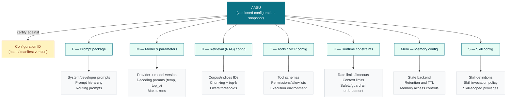
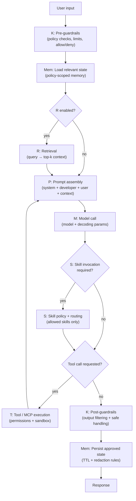
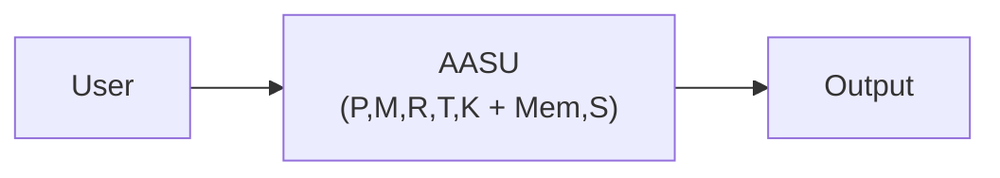
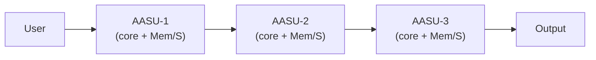
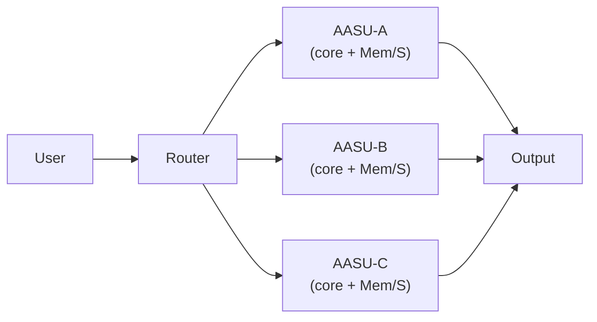
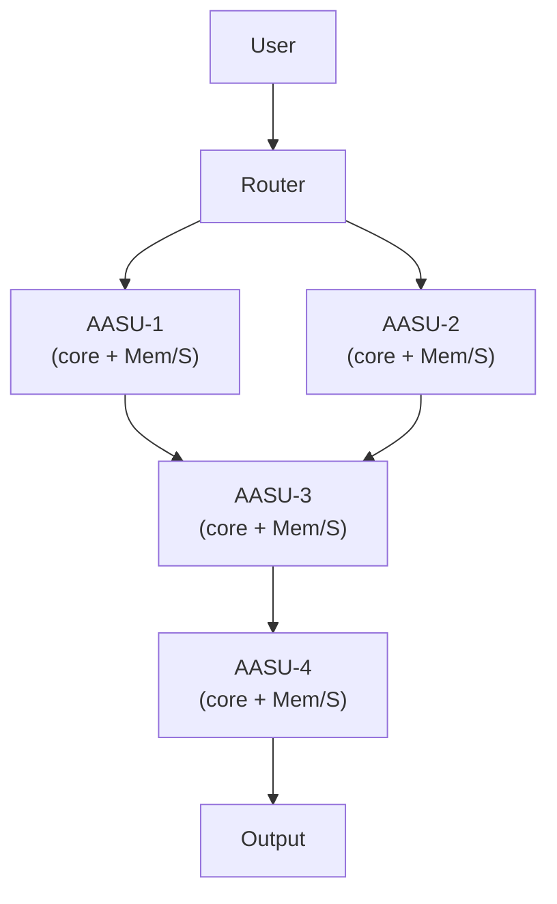
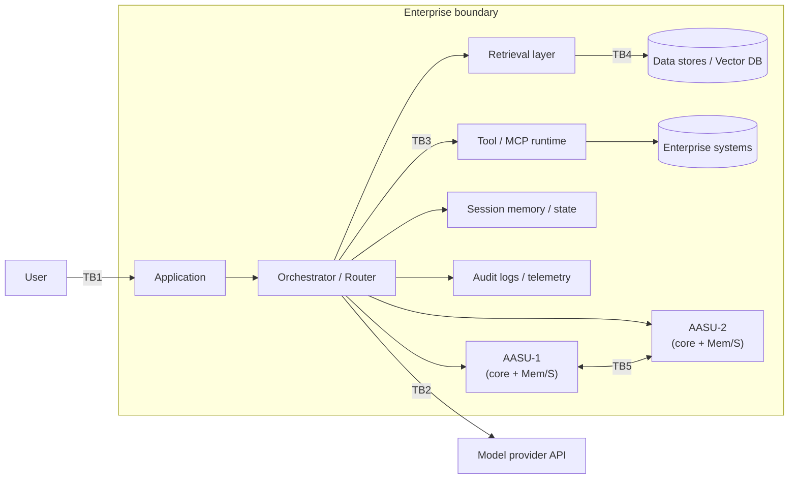
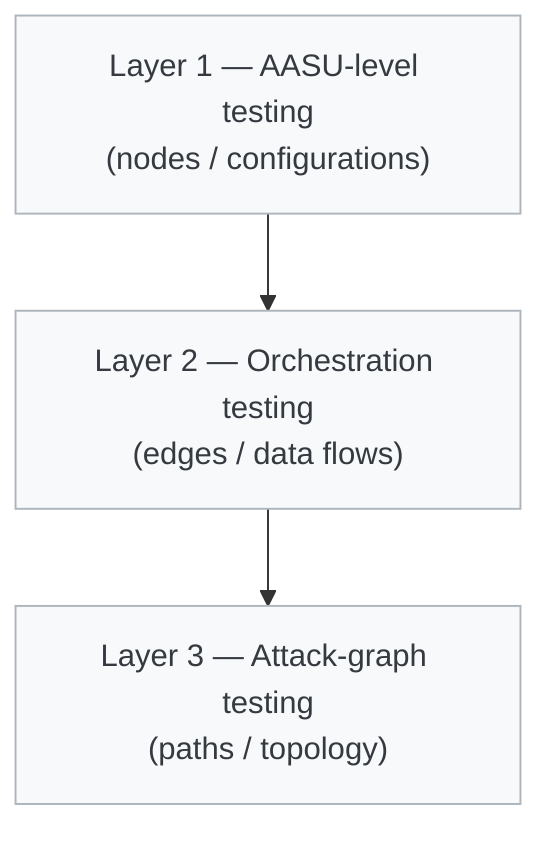
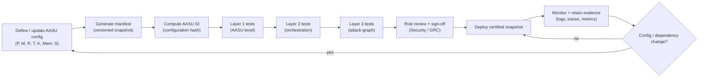

# Defining the Atomic AI Security Unit (AASU)

## Enterprise-Grade AI Security Architecture & Validation Framework

### Consolidated White Paper (v2.2)

**Document ID:** AASU-WP-2.2-CONSOLIDATED  
**Version:** 2.2 (Consolidated from v1.0, v1.2, and v2.2)  
**Date:** 2026-02-23  
**Intended Audience:** CISO \| AI Security Engineering \| Red Team \| AppSec \| ML Platform \| Risk & GRC \| Enterprise Architecture \| Audit/Regulators  
**Classification:** Public / External Distribution Ready

**Sources consolidated:**
- `Atomic_AI_Security_Unit_AASU_White_Paper.md` (v1.0)
- `AASU_White_Paper_Publish_Ready_v1_2.md` (v1.2)
- `AASU_White_Paper_Extended_v2_2_Enriched.md` (v2.2)

---

## Executive Summary

Modern enterprise GenAI systems are not single-model deployments. They are configuration-bound, tool-enabled, retrieval-augmented, orchestrated computational graphs.

Security failures in these systems are rarely “model-only” issues. They are configuration, orchestration, and topology issues. Two applications using the same model can exhibit materially different risk profiles depending on prompts, tool access, retrieval configuration, and runtime parameters.

This paper formalizes a security abstraction for repeatable testing and governance:

> **Atomic AI Security Unit (AASU)** — the smallest configuration-bound AI system instance that must be treated as a single unit for security testing, red teaming, and audit validation.

It further defines architecture-aware testing patterns, a three-layer validation methodology (unit → orchestration → attack-graph), and mappings to common AI security taxonomies (OWASP and MITRE ATLAS).

---

## 1. The Core Problem: Model-Only Security Is Structurally Incomplete

Traditional application security assumes deterministic software behavior. Modern GenAI systems are configuration-driven and behaviorally emergent.

**The model is not the unit of risk. The configuration is the unit of risk.**

Security posture is best expressed as:

**Security posture = f(configuration, topology, privilege graph, routing/orchestration logic)**

Not:

**Security posture = f(model)**

---

## 2. The Atomic AI Security Unit (AASU)

### 2.1 Formal Definition

An AASU is a tightly bound, versioned configuration:

**AASU core = (P, M, R, T, K)**  
**AASU extension = (Mem, S)**

Where:
- **P = Prompt Package** (system prompts, templates, policy prompts, routing prompts, prompt hierarchy, prompt chaining)
- **M = Model Instance & Parameters** (model identity/version/provider plus decoding/runtime parameters that shape behavior)
- **R = Retrieval Configuration** (RAG settings, corpus selection, embedding model, chunking, filters, top-k, thresholds)
- **T = Tool/MCP Configuration** (tool schemas, connectors/plugins, permissions, execution environment, Model Context Protocol if present)
- **K = Runtime Constraints / Guardrails** (policy enforcement, timeouts, rate limits, context limits, safety filters, sandbox constraints)
- **Mem = Memory Configuration** (short/long-term memory backend, retention, access controls, state isolation)
- **S = Skill Configuration** (skill package composition, invocation policy, skill-scoped permissions)

Illustrative runtime flow for a single user request through an AASU:

**Any change in P, M, R, T, K, Mem, or S creates a new AASU.**

### 2.2 Configuration Snapshot Principle

While LLM outputs are probabilistic, the security posture of an AASU is **configuration-deterministic**: if you change the configuration, you change the risk profile.

Small changes can materially alter:
- Prompt injection susceptibility
- Tool misuse risk
- Data leakage exposure (especially via retrieval)
- Escalation behavior across agents/tools

Security testing and certification must bind to a **configuration snapshot** (ideally a versioned manifest and/or configuration hash), not a model name.

---

## 3. Enterprise Deployment Patterns (Topology Matters)

In enterprise systems, AASUs rarely operate in isolation. They are deployed in directed topologies where outputs, retrieved context, and tool results flow between nodes.

### 3.1 Single AASU

**Primary security surface:**
- Prompt injection
- Insecure output handling (downstream parsing / actioning)
- Tool misuse (if tools are enabled)
- Sensitive information disclosure (if retrieval is enabled)

### 3.2 Sequential Chain Pattern (Chained Units)

User → AASU-1 → AASU-2 → AASU-3 → Output

**Key risks:**
- Cascading failure
- Injection amplification and persistence across steps
- Context contamination between stages
- Privilege escalation chains (especially if later nodes have broader tool permissions)

**Testing implications:**
- Per-unit adversarial testing (each node as an AASU)
- Cross-unit validation (how attacks propagate)
- Multi-stage attack simulation (end-to-end)

### 3.3 Parallel Agent Fabric (Router + Multiple AASUs)

User → Router → Multiple Independent AASUs → Output(s)

**Key risks:**
- Surface area expansion (more prompts, tools, corpora, and policies)
- Policy inconsistency between agents
- Routing manipulation (attacker influences which AASU is invoked)
- Privilege skew (one agent has “too much” authority)

**Testing implications:**
- Independent unit testing per AASU
- Routing logic testing (manipulation, downgrade/upgrade paths)
- Cross-agent policy audits (consistency and least privilege)

### 3.4 Hybrid Directed AI Graph (Graph of AASUs)

Nodes = AASUs  
Edges = data-flow, context-flow, or tool-result reinjection relationships

**Key risks:**
- Emergent systemic behavior (graph-level, not node-level)
- Recursive tool abuse / repeated execution loops
- Cross-branch contamination (one branch pollutes another)
- Graph-level privilege escalation (pivoting along edges)

This pattern requires graph-based security modeling in addition to per-AASU testing.

---

## 4. Formal Threat Model (AASU-Aware)

### 4.1 Assets

- Sensitive data (PII, financial, proprietary)
- Tool capabilities (refunds, exports, writes, admin actions)
- Retrieval corpora and vector indices
- Model credentials, API keys, and service accounts
- Session state, conversation memory, and orchestration state

### 4.2 Threat Actors

- External attackers
- Malicious insiders
- Prompt injection adversaries
- Supply chain document attackers (malicious content inserted into corpora)
- Automated adversarial bots

### 4.3 Trust Boundaries

1. User → Application
2. Application → Model Provider
3. Model/Orchestrator → Tool Execution Environment
4. Retrieval Layer → Data Stores / Vector DBs
5. Agent → Agent (in chained or multi-agent systems)

### 4.4 Data-Flow Considerations

- Context expansion via retrieval (RAG)
- Tool outputs reinjected into prompts (tool-result → context)
- Cross-agent message passing
- Memory persistence between sessions

### 4.5 Representative Abuse Cases

- Prompt hierarchy override (system/developer instructions subverted)
- Tool escalation (inducing unauthorized tool calls)
- Retrieval poisoning (malicious documents or embeddings influencing outputs/actions)
- Cross-agent privilege pivot (low-privilege agent → high-privilege agent)
- Recursive execution abuse (loops, runaway actions, excessive agency)

---

## 5. Multi-Layer Validation Model (Unit → Orchestration → Graph)

Security validation must reflect architectural complexity. The AASU model supports a three-layer approach:

### Layer 1: AASU-Level (Configuration-Level) Testing

Test each AASU as a configuration-bound unit:
- Prompt injection resistance (including obfuscation and multilingual bypass attempts)
- Tool misuse simulation (schema abuse, parameter injection, permission boundary probing)
- Retrieval leakage validation (sensitive info disclosure, over-broad retrieval, prompt injection via retrieved docs)
- Output integrity and unsafe downstream handling checks
- Robustness testing (edge-case inputs, jailbreak variants, policy evasion)

### Layer 2: Orchestration-Level Testing

Test the orchestration and data flows between AASUs:
- Injection propagation across nodes
- Retry-path exploitation (how failures/retries change behavior or privileges)
- State poisoning (memory, cached context, intermediate artifacts)
- Boundary drift detection (policies or constraints weakening across steps)

### Layer 3: Attack-Graph (System-Level) Testing

Test the full directed graph as an attack surface:
- Multi-agent privilege escalation and pivots along edges
- Routing manipulation and downgrade/upgrade attacks
- Cross-AASU exfiltration (retrieval → tool → output)
- Graph traversal risk modeling (what an attacker can reach from an entry point)

---

## 6. Governance, Versioning, and Audit Readiness

### 6.1 Minimum AASU Versioning Requirements

Each AASU should maintain, at minimum:
- Configuration ID (or configuration hash)
- Prompt version
- Model version
- Tool/MCP version
- Retrieval version (if present)
- Parameter/constraint set (runtime guardrails)

**Any modification invalidates prior certification** for that AASU configuration snapshot.

### 6.2 Audit-Ready Outcomes Enabled by AASU Governance

- Configuration-hash binding of test results and red-team findings
- Mandatory retesting on configuration change
- Node/path/topology coverage metrics for complex systems
- Traceable certification statements tied to specific AASU IDs
- Risk acceptance tied to explicit configuration snapshots (not “the chatbot in general”)

---

## 7. Standards and Technique Alignment (OWASP + MITRE ATLAS)

Taxonomies evolve. The mappings below reflect the referenced versions used in the source documents and should be updated to match the exact versions adopted by your organization.

### 7.1 OWASP Top 10 for LLM Applications (2023) Mapping

| OWASP ID | Category | AASU Impact Area |
|---|---|---|
| LLM01 | Prompt Injection | Prompt (P), Retrieval (R) |
| LLM02 | Insecure Output Handling | Output layer, downstream parsers |
| LLM03 | Training Data Poisoning | Model (M), Retrieval (R) |
| LLM04 | Model Denial of Service | Runtime (K), Orchestration |
| LLM05 | Supply Chain Vulnerabilities | Model provider, embeddings |
| LLM06 | Sensitive Information Disclosure | Retrieval (R), Prompt (P) |
| LLM07 | Insecure Plugin Design | Tooling (T) |
| LLM08 | Excessive Agency | Tooling (T), Orchestration |
| LLM09 | Overreliance | Human-in-the-loop absence |
| LLM10 | Model Theft | Model serving, API access |

### 7.2 OWASP Top 10 for LLM Applications (2025) Mapping

| OWASP ID | Risk Category | AASU Component |
|---|---|---|
| LLM01:2025 | Prompt Injection | P, R |
| LLM02:2025 | Sensitive Information Disclosure | R, P |
| LLM03:2025 | Supply Chain | M, T |
| LLM04:2025 | Data & Model Poisoning | M, R |
| LLM05:2025 | Improper Output Handling | Output layer |
| LLM06:2025 | Excessive Agency | T, Orchestration |
| LLM07:2025 | System Prompt Leakage | P |
| LLM08:2025 | Vector & Embedding Weaknesses | R |
| LLM09:2025 | Misinformation | P, R |
| LLM10:2025 | Unbounded Consumption | K |

### 7.3 OWASP Top 10 for Agentic Applications (2026) Mapping

| ASI ID | Risk Category | Impact Area |
|---|---|---|
| ASI01 | Agent Goal Hijack | P, Orchestration |
| ASI02 | Tool Misuse | T |
| ASI03 | Identity & Privilege Abuse | T |
| ASI04 | Agentic Supply Chain | MCP / tool ecosystem |
| ASI05 | Unexpected Code Execution | Tool runtime |
| ASI06 | Memory Poisoning | R |
| ASI07 | Inter-Agent Insecurity | Routing |
| ASI08 | Cascading Failures | Sequential chains |
| ASI09 | Human-Agent Trust Exploitation | UX |
| ASI10 | Rogue Agents | Runtime |

### 7.4 MITRE ATLAS Technique Mapping

| ATLAS Technique | Description | Relevant AASU Component |
|---|---|---|
| AML.TA0001 | Initial Access | Prompt layer |
| AML.TA0002 | Execution | Tool invocation |
| AML.TA0003 | Persistence | Session memory |
| AML.TA0004 | Privilege Escalation | Tool chaining |
| AML.TA0005 | Defense Evasion | Prompt obfuscation |
| AML.TA0006 | Credential Access | Tool misuse |
| AML.TA0007 | Discovery | Retrieval probing |
| AML.TA0008 | Lateral Movement | Cross-agent pivot |
| AML.TA0009 | Exfiltration | Tool export, retrieval |
| AML.TA0010 | Impact | Tool-based destructive action |

---

## 8. Formal Model Summary

**AASU core = (P, M, R, T, K) + extension (Mem, S)**

**AI System = Directed Graph of AASUs**

**Security Risk = f(Configuration, Topology, Privilege Edges, Routing Logic)**

Testing coverage (conceptually) must account for:
- **AASU coverage** (per-node testing against each configuration snapshot)
- **Graph coverage** (edge/path/topology testing across the deployed system)

---

## 9. Conclusion

Modern AI systems are configuration-bound entities deployed in directed topologies.

The Atomic AI Security Unit (AASU) model enables:
- Precise scoping for testing and red teaming
- Architecture-aware validation for chained and multi-agent systems
- Version-bound governance with audit-ready evidence
- Regulatory defensibility through configuration-linked certification

Organizations that adopt AASU-based validation move from ad-hoc model testing to structured AI security engineering.

---

**End of Consolidated White Paper (v2.2)**
