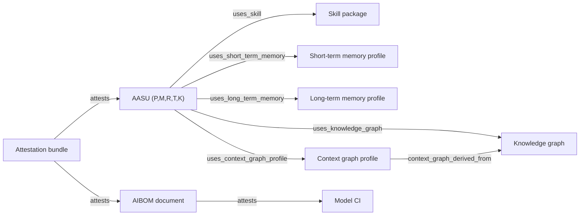
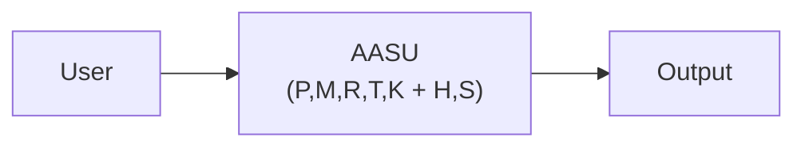
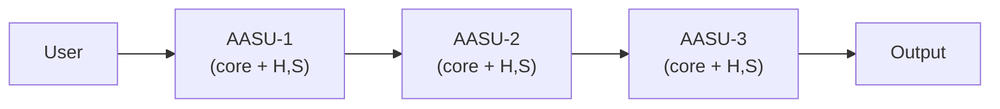
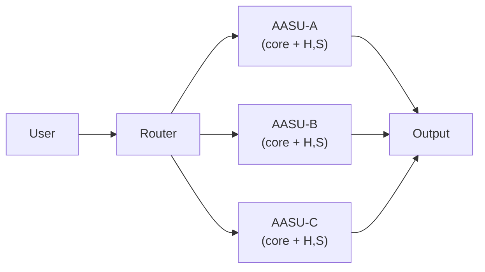

# Atomic AI Security Unit (AASU)
[](https://github.com/SAISec/AASU/actions/workflows/registry-validate.yml)
[](LICENSE)

**AASU core = (P, M, R, T, K)**  
Prompt package, Model instance & parameters, Retrieval configuration, Tool/MCP configuration, Runtime constraints.

**AASU extension = (H, S)**  
History/memory configuration and skill configuration.

This repository provides:
- The AASU white paper (Markdown + HTML/PDF) — **primary deliverable**
- A Git-native CMDB-as-code protocol for asset mapping and audit-ready governance
- A reference registry + CLI tooling for GitHub PR workflows (add-on)

## v1alpha2 governance extensions
This repo now includes first-class registry support for:
- **Skills as separate assets** (`spec.type: skill_package`)
- **Short-term memory profiles** (`spec.type: memory_short_term_profile`)
- **Long-term memory profiles** (`spec.type: memory_long_term_profile`)
- **Knowledge/context graph profiles** (`knowledge_graph`, `context_graph_profile`)
- **AIBOM and attestation assets** (`aibom_document`, `attestation_bundle`)

The core AASU abstraction remains unchanged: `(P,M,R,T,K)`. These extensions are linked through relationships for governance and impact analysis.

## Quick links
- Protocol: `docs/protocol.md`
- Registry & tooling: `docs/registry.md`
- GitHub Pages site entry: `docs/index.md`
- Public roadmap: `ROADMAP.md`
- Implementation backlog (working TODOs): `TODO.md`

## AASU unit decomposition
An Atomic AI Security Unit is a **configuration-bound** unit:

**AASU core = (P, M, R, T, K)**
- **P**: Prompt package
- **M**: Model instance & parameters
- **R**: Retrieval configuration (RAG)
- **T**: Tool/MCP configuration
- **K**: Runtime constraints
- **H**: History/memory configuration (optional extension)
- **S**: Skill configuration (optional extension)

Any change to **P/M/R/T/K/H/S** creates a new AASU and requires re-validation.

Related governance controls are modeled as separate CIs and relationships:
- skills (`uses_skill`)
- short-term memory (`uses_short_term_memory`)
- long-term memory (`uses_long_term_memory`)
- knowledge graph and context graph profile (`uses_knowledge_graph`, `uses_context_graph_profile`)
- attestations (`attests`)



## Architecture patterns (chains and graphs)
Modern AI systems are composed of multiple AASUs, typically in these patterns:

- **Single AASU**: User → AASU → Output  
  Risks: prompt injection, tool misuse, retrieval leakage



- **Sequential chain**: User → AASU‑1 → AASU‑2 → AASU‑3 → Output  
  Risks: cascading failure, injection amplification, context contamination, privilege escalation chains


- **Parallel agent fabric**: User → Router → {AASU‑A, AASU‑B, AASU‑C}  
  Risks: routing manipulation, policy inconsistency, surface area expansion


- **Hybrid directed graph**: Nodes = AASUs, Edges = data flow  
  Risks: emergent behavior, cross‑branch contamination, recursive tool abuse

## Validation layers (overview)
1. **AASU‑level testing**: prompt injection, tool misuse, retrieval leakage
2. **Orchestration testing**: cross‑unit contamination, state poisoning
3. **Attack‑graph testing**: multi‑agent escalation, cross‑AASU exfiltration

## How AASU differs from typical AI and agentic AI applications
- **Unit of analysis**: AASU treats the *configuration snapshot* (P/M/R/T/K, optionally H/S) as the unit of risk, not the model or the app.
- **Topology‑aware**: Typical AI app reviews are per‑app; AASU models chains, routers, and graphs as a security surface.
- **Certification‑bound**: Validation ties evidence to a specific configuration hash; any change creates a new AASU.
- **Agentic clarity**: Agentic systems often blur boundaries; AASU makes each agent an explicit, testable unit with clear edges and privileges.
- **Governance‑first**: AASU is designed for auditability, approval workflows, and CMDB‑aligned change control.

## FAQ
**Is AASU just a model card?**  
No. AASU covers the full configuration snapshot (P/M/R/T/K, optionally H/S), including retrieval, tooling, runtime guardrails, memory behavior, and skill behavior.

**Do I need AASU if I only use one model?**  
Yes—prompt, tools, and runtime constraints can materially change risk even when the model stays the same.

**How does AASU relate to agentic systems?**  
Each agent is an AASU; the overall system is a directed graph of AASUs with explicit edges and privilege flows.

**Are the validation scripts required?**  
They are add‑ons. The core deliverable is the AASU concept and white paper; tooling exists to operationalize it in Git workflows.

## Repository structure
```
docs/            GitHub Pages content
registry/        CMDB-as-code registry (manifests + schemas)
tools/           Registry CLI and utilities
arxiv_paper/     LaTeX source for submission-style paper
```

## Local usage (registry)
```bash
python3 tools/aasu_registry.py validate
python3 tools/aasu_registry.py fingerprint --all --write
python3 tools/aasu_registry.py policy-check
python3 tools/aasu_registry.py memory-audit --strict
python3 tools/aasu_registry.py attest-verify
```

## Contributing
See `CONTRIBUTING.md` for branch, PR, and validation requirements.

## Security
See `SECURITY.md` for reporting guidelines.

## License
Apache-2.0. See `LICENSE`.
